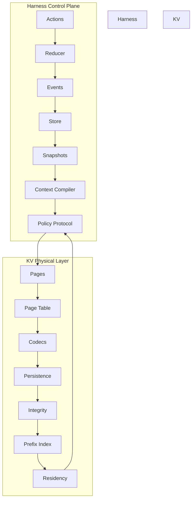

# RFSN Agent Harness

External, deterministic, event-sourced control plane for RFSN/OMLX agents.

## Architecture



## Module Inventory

| Module | Purpose | Lines |
|--------|---------|-------|
| `rfsn_agent/types.py` | Strong identifiers and enumerations | 55 |
| `rfsn_agent/common.py` | Deterministic hashing and serialization | 159 |
| `rfsn_agent/domain.py` | Immutable domain schemas | 682 |
| `rfsn_agent/events.py` | Append-only event schemas | 606 |
| `rfsn_agent/reducer.py` | Pure event reducer with invariant checks | 600 |
| `rfsn_agent/store.py` | SQLite WAL persistence | 1,524 |
| `rfsn_agent/context.py` | Deterministic context compiler | 760 |
| `rfsn_agent/actions.py` | Typed semantic actions | 578 |
| `rfsn_agent/runtime.py` | Agent runtime loop | 178 |
| `rfsn_agent/cas.py` | Content-addressed store | 141 |
| `rfsn_agent/security.py` | Safety profiles | 57 |
| `rfsn_agent/tool_worker.py` | Async tool execution with lease deduplication | 292 |
| `rfsn_agent/omlx.py` | OMLX inference adapter protocols | 155 |
| `rfsn_agent/evaluation.py` | Objective evaluator and cryptographic receipts | 178 |
| `rfsn_kv/types.py` | KV identifiers and enumerations | 41 |
| `rfsn_kv/common.py` | KV hashing and serialization utilities | 221 |
| `rfsn_kv/pages.py` | Immutable KV page representation | 186 |
| `rfsn_kv/page_table.py` | Logical→physical position mapping | 164 |
| `rfsn_kv/codecs/base.py` | Codec protocol | 34 |
| `rfsn_kv/codecs/identity.py` | Passthrough codec | 48 |
| `rfsn_kv/codecs/quantize.py` | Byte-level quantization | 207 |
| `rfsn_kv/codecs/__init__.py` | Codec registry | 40 |
| `rfsn_kv/persistence.py` | SQLite-backed page storage | 272 |
| `rfsn_kv/integrity.py` | Page integrity verification | 82 |
| `rfsn_kv/prefix_index.py` | Copy-on-write prefix sharing | 292 |
| `rfsn_kv/residency.py` | LRU eviction and pin management | 239 |
| `rfsn_kv/kernels/__init__.py` | Kernel protocol stub | 26 |

## Build/Test

```bash
# Install dependencies
pip install -e ".[dev]"

# Run tests
python -m pytest

# Type checking
python -m mypy rfsn_agent rfsn_kv

# Linting
python -m ruff check rfsn_agent rfsn_kv tests
```

## P0 Progress

| Phase | Description | Status |
|-------|-------------|--------|
| 1 | HarnessEvent and immutable domain schemas | ✅ Complete |
| 2 | Pure event reducer with invariant checks | ✅ Complete |
| 3 | SQLite/CAS persistence and trajectory isolation | ✅ Complete |
| 4 | Deterministic ContextPacket compiler | ✅ Complete |
| 5 | Typed semantic actions with validated preconditions | ✅ Complete |
| 6 | Context epochs and prefix/suffix reuse rules | ✅ Complete |
| 7 | OMLX inference adapter | ✅ Complete |
| 8 | One multi-file coding benchmark | 🔲 Not started |
| 9 | Objective evaluator and receipts | ✅ Complete |
| 10 | Optional MLX tensor codec and compressed-page kernel protocols | ✅ Complete |

## Conventions

- Python 3.11+
- All domain objects: immutable frozen dataclasses (`frozen=True, slots=True`)
- Every content-bearing object: SHA-256 content hash at construction
- Every domain object: provenance (`actor`, `action_id`, optionally `event_id`)
- Events: append-only
- Snapshots: derived by pure reducers
- Collections: `tuple` for hashable/deterministic
- Persistence: SQLite/CAS filesystem (no Redis)

## License

See LICENSE file for details.
